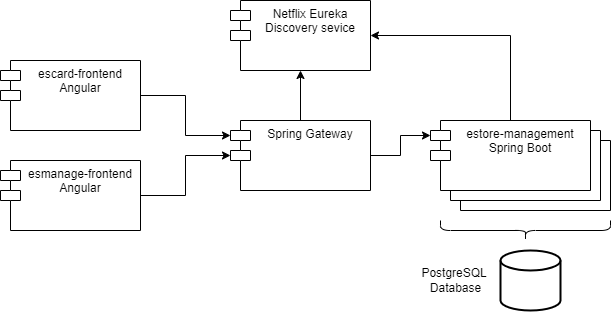
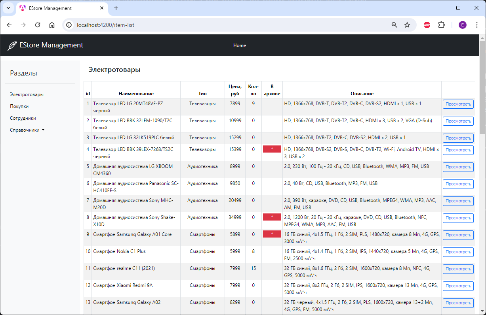
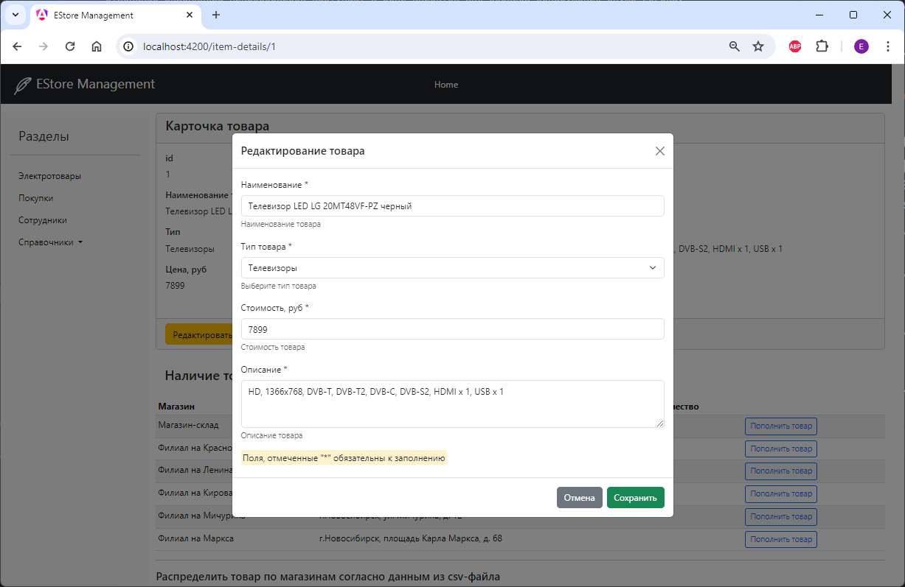
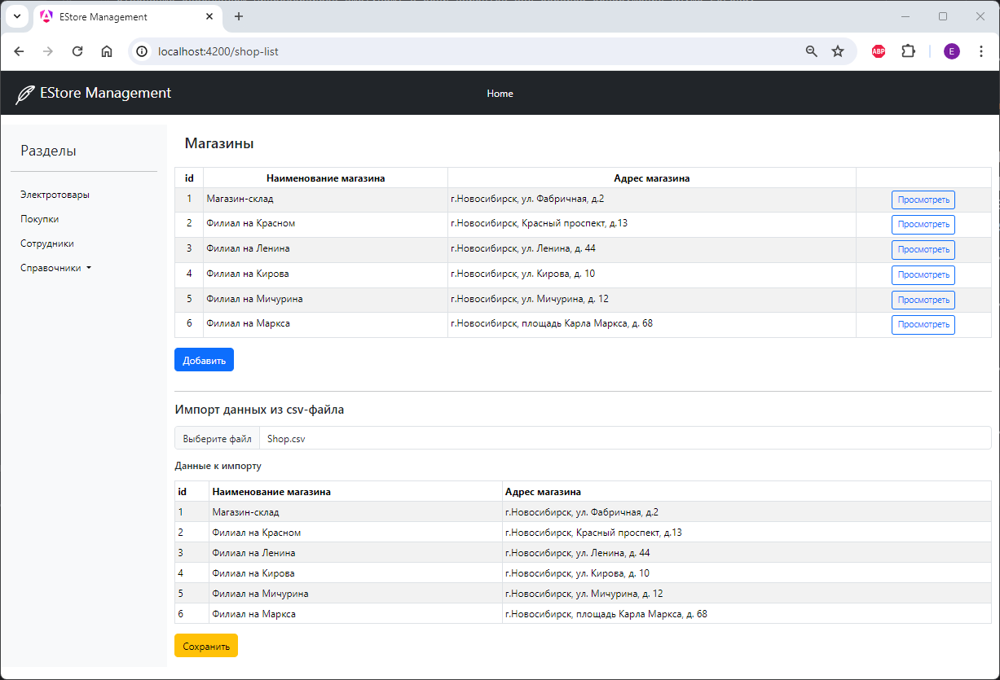
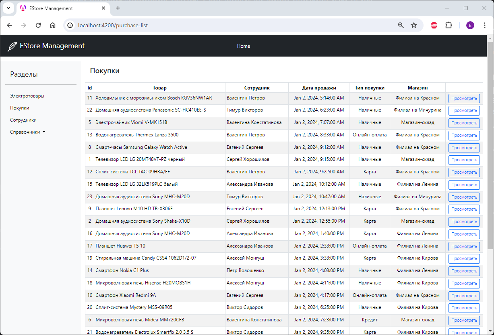
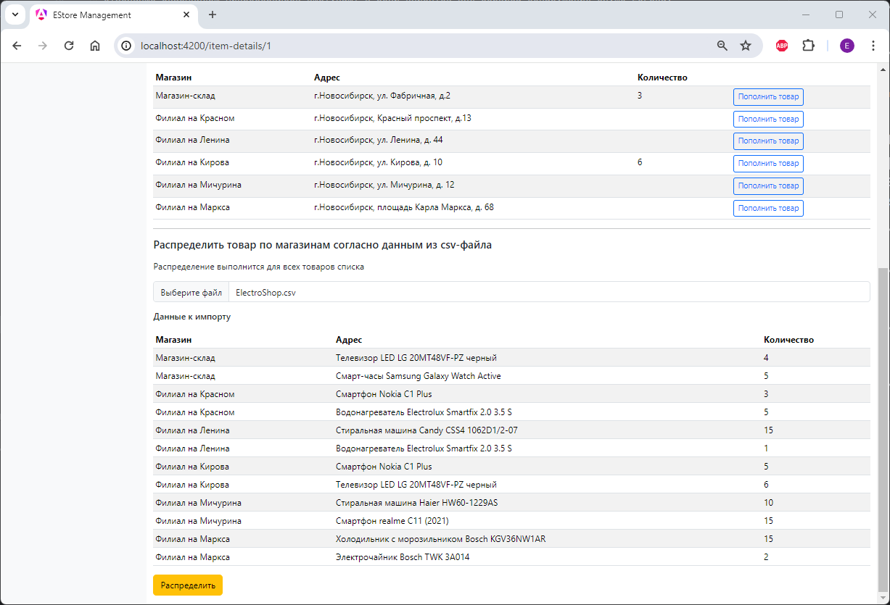
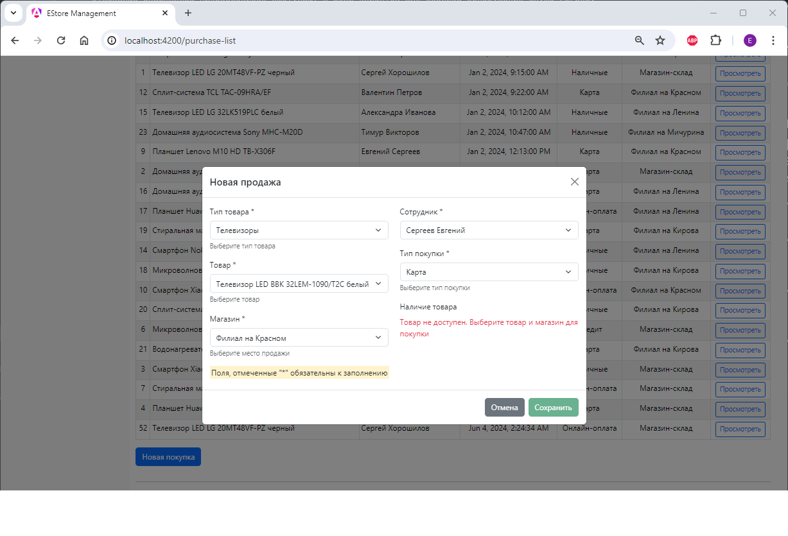

# EStore

## Общая диаграмма проекта

В части реализации API выполнены:

* Backend сервис: реализованы репозитории в соответствие со структурой БД, реализован сервисный слой, REST-контроллеры.
* Отдельные экземпляры микросервисов выступают в роли клиентов для сервиса обнаружения служб Eureka.
* Реализован Gateway как единая точка доступа к REST API.

Клиентские приложения реализованы на базе Angular

## Общие функциональные требования к приложению 1 (estore-management + esmanage-frontend):

* Хранение основных реестров для добавления, отображения и редактирования информации

Список товаров

Редактирование товара

* Хранение вспомогательных справочников (с возможностью редактирования) для идентификации данных в основных 
реестрах

Справочник магазинов с возможностью редактирования и импорта из csv-файла

* Хранение вспомогательных связующих таблиц для определения множественных ссылок между таблицами 

* Сортировка реестра покупок - по дате осуществления покупки

* Импорт данных из файлов csv 

* Проверка на наличие необходимого товара в магазине, в противном случае – запись о покупке не формировать и вывести
соответствующую информацию об ошибке во всплывающей подсказке

